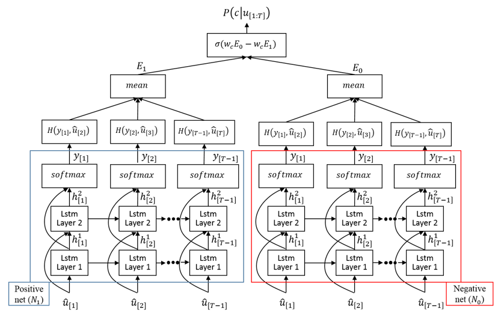
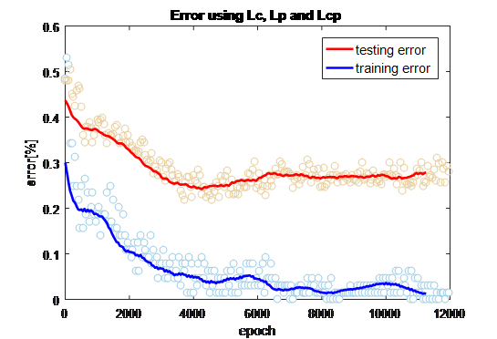
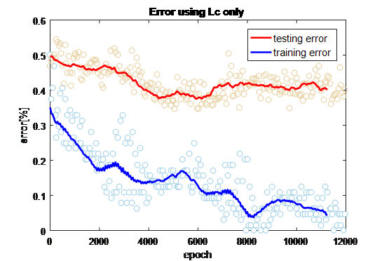
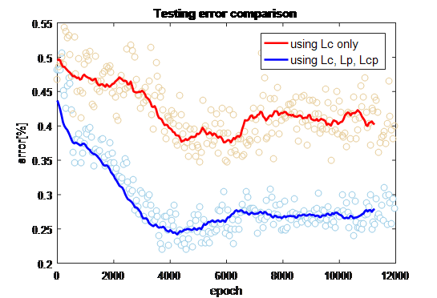
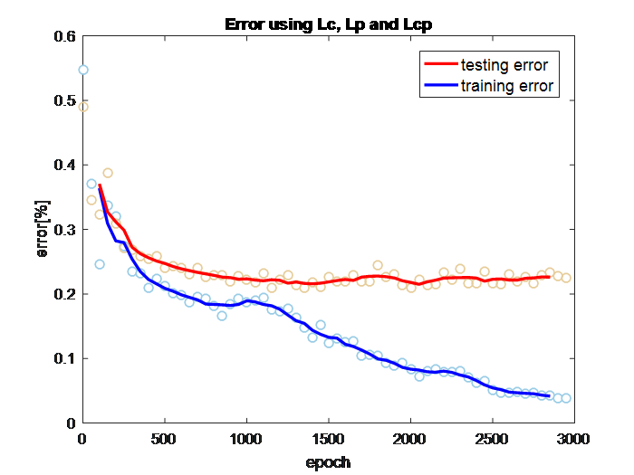
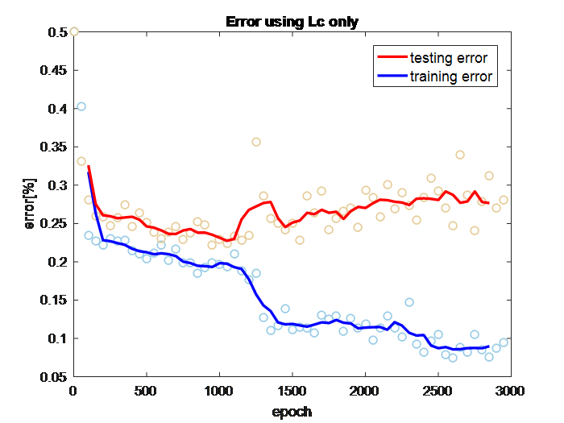
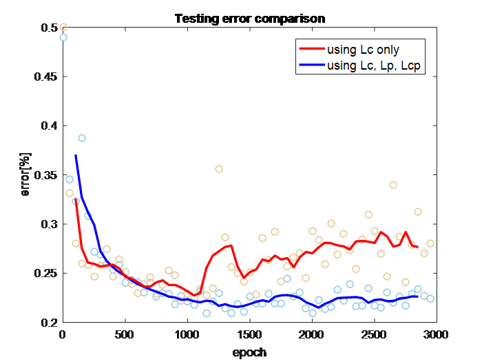

# Simultaneous Generation-Classification Using LSTM

In this repository you can find the implementation of the Neural Network architecture presented in the paper: Simultaneous Generation-Classification Using LSTM, authored by Daniel Marino, Kasun Amarasinghe, Milos Manic, presented at the 2016 IEEE Symposium Series on Computational Intelligence (SSCI). DOI: [10.1109/SSCI.2016.7850115](https://doi.org/10.1109/SSCI.2016.7850115), [ResearchGate](https://www.researchgate.net/publication/313808538_Simultaneous_generation-classification_using_LSTM)

The idea that a concept is properly learned by an agent only when the agent is able to reproduce examples of it, is a mechanism that humans often use to evaluate their understanding of a particular concept. In this paper, we propose an LSTM-based architecture that was designed for simultaneously:  

1. generating sequences for a given class 

2. given a sequence, predicting the class to which it belongs

The presented generation-classification methodology was implemented on a sentiment analysis task. However, it can be applied to any sequence modelling or classification task. The following are the main advantages of the presented architecture:

* The experimental results suggest that jointly training the network to achieve simultaneous generation-classification improves generalization on the classification task. This approach of using the generation procedure as a regularization technique reassembles the use of Restricted Boltzmann Machines or auto-encoders for pre-training of deep neural networks. 
* The generation of sequences allows to directly prove the network, which allows to understand and evaluate the performance of the network and how it is behaving. 

The following figure illustrates the proposed architecture when used for generating/classifying sequences that belong to two classes (e.g. positive and negative classes):

As can be seen, the architecture is basically an ensemble of _C_ LSTM networks,  _Net={Nc  |  c ∈ C}_,  where _C_ is the set of classes. Each one of the networks _Nc_ serves as a sequence model for the corresponding class _c_. 

Having the set of networks _Net_, the class of a given sequence _u[1:T]_  can be predicted by evaluating which _Nc_ better predicts the given sequence. This is the idea behind the presented generation-classification architecture. 

The architecture is trained on a set of pairs _(u[1:T] ,c)_, where _u[1:T]_  is a given sequence and _c_ is the class to which u[1:T]  belongs. The training aims to jointly minimize a multi-objective function that tries to minimize the classification error, and a measure of "hot good" are the sequences generated by the LSTM networks:

where:
* _Lc_ is a classification loss that evaluates if the network predicted the class of _u[1:T]_ correctly
* _Lp_ is a loss that evaluates how good are the sequences generated by each one of the _Nc_ networks for their particular class _c_
* _Lcp_ is a loss that punishes a network _Nc_ when generating sequences that are "similar" to classes that do not belong to their respective class _c_. 

## Experiments
The generation-classification architecture was implemented and tested on a sentiment analysis task. Given a set of positive and negative reviews, the proposed architecture was trained to generate positive and negative reviews and classify a given review into positive or negative class. The architecture was tested on a dataset of tweets [1], and on the imdb movie review dataset [2]

To evaluate the effects that the joint generation-classification training has on the classification performance of the architecture, the performance of a network trained using Eq. 1 as the objective function was compared with the performance of the same network trained using only _Lc_ on Eq. 1 as the objective function. The idea behind the experiment was to evaluate how the performance of the network varied when trained for simultaneous generation-classification (Eq.1 which includes _Lc,Lp,Lcp_) and when it is trained only for classification (i.e. using only _Lc_ as the objective). The architecture was kept the same for both scenarios to ensure that the capacity of the network is not changed. 

The following are the results:

<b> For dataset of tweets: </b>

<b> For the imdb movie review dataset: </b>
Ussing dictionary of the 3000 most frequent words

As can be seen, jointly optimizing for classification-generation provided a model with better generalization and a more stable training. During the experiments, it was also seen that the model trained without including the generation loss (only _Lc_), often plateaued. 

## Prerequisites
The script uses the 2dlearn library https://github.com/danmar3/2dlearn-lib. To use the library, clone the repository and add the library's directory to the PYTHONPATH environmental variable.

  

[1] P. Nakov, A. Ritter, S. Rosenthal, F. Sebastiani and V. Stoyanov, "SemEval-2016 task 4: Sentiment analysis in Twitter," in 10th international workshop on semantic evaluation (SemEval 2016), San Diego, US, 2016

[2] A. L. Maas, R. E. Daly, P. T. Pham, D. Huang, A. Y. Ng and C. Potts, "Learning Word Vectors for Sentiment Analysis," in Proceedings of the 49th Annual Meeting of the Association for Computational Linguistics: Human Language Technologies, 2011. 

